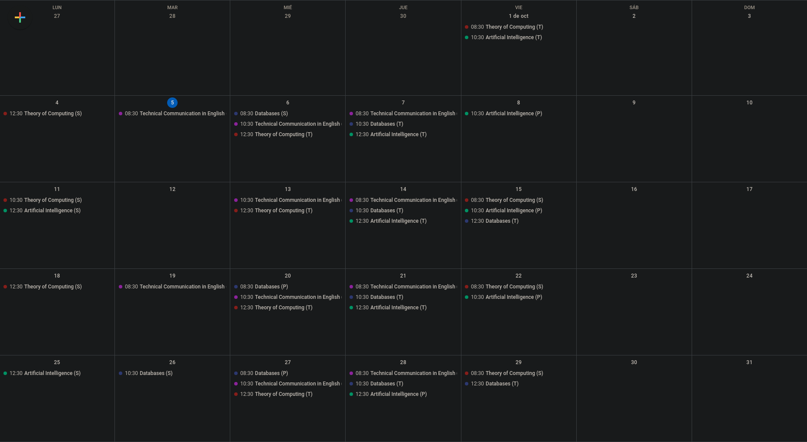
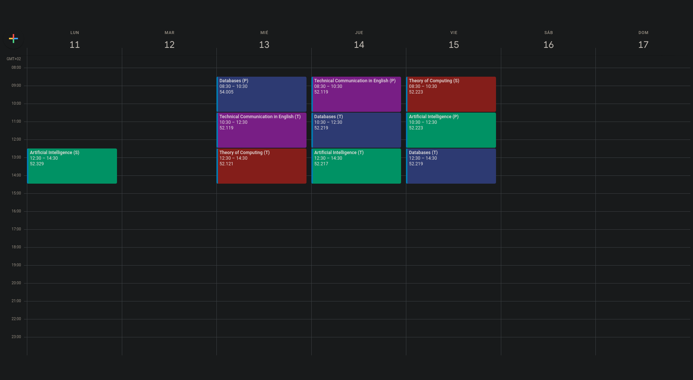

Esta aplicación nos permite transferir el horario de la página web de la [Universidad Pompeu Fabra](https://www.upf.edu) a un archivo [JSON](https://en.wikipedia.org/wiki/JSON) que automáticamente se usará para añadir los horarios a [Google Calendar](https://calendar.google.com/calendar/u/0/r) con el nombre de la asignatura, la clase, el inicio, el final y el tipo de clase. Para añadir eventos al calendario, se usa la [Google Calendar API](https://developers.google.com/calendar/api).

Esta aplicación no requiere que el usuario introduzca datos sensibles de inicio de sesión en el Campus Global o ningún otro tipo de información, así que en todo momento tus datos sensibles son respetados.

### Índice de Contenido

1. [Requisitos Previos](#1-requisitos-previos)

2. [Instalación](#2-instalación)

3. [Seleccionar las Preferencias](#3-seleccionar-las-preferencias)

4. [Ejecutar el Programa](#4-ejecutar-el-programa)

5. [Información para Desarrolladores](#5-información-para-desarrolladores)

### 1. Requisitos Previos

- [Python 3.8](https://www.python.org/downloads/) o versiones superiores.
  (Hay una [versión del programa para Python 3.7](https://github.com/Sklyvan/ScrapingUPF/tree/oldpython) y versiones inferiores, pero no está en mantenimiento.)

- [Python Package Installer](https://github.com/pypa/pip) (PIP) 

### 2. Instalación

#### - MacOS, Linux & UNIX-Like Systems.

```shell
git clone https://github.com/Sklyvan/ScrapingUPF.git
cd ScrapingUPF/
pip install -r CoreRequirements.txt # Si PIP da error, hay que usar pip3.
```

#### - Windows

1. [Descargar Repositorio.](https://github.com/Sklyvan/ScrapingUPF/archive/refs/heads/main.zip)

2. Descomprimir el archivo descargado.

3. Abrir una terminal en el directorio ScrapingUPF.

4. Seguir los pasos:
   
   ```shell
   cd ScrapingUPF/
   pip install -r CoreRequirements.txt # Si PIP da error, hay que usar pip3.
   ```

### 3. Seleccionar las Preferencias

La selección de asignaturas se hace modificando el archivo [UserPreferences.ini](UserPreferences.ini), no hay que modificar nada más del programa para su uso común. **Solo se puede añadir una línea de cada elemento, es decir, no se pueden añadir dos PlanEstudio.**
<br>
Si hay alguna duda sobre cuál es su código de su Plan de Estudio, el Plan Docente o similares, se pueden conocer mediante: [Calendario y Horarios](https://gestioacademica.upf.edu/pds/consultaPublica/look%5Bconpub%5DInicioPubHora?entradaPublica=true&idiomaPais=ca.ES&centro=332&estudi=3324&planDocente=2021) <br>
<br>
· **Connection**: Este apartado solo contiene los Headers de la petición, solo es necesario para usuarios que tengan algún problema, no debería ser necesario modificar los valores que se encuentran por defecto.

· **Basic Information**: Este apartado contiene información genérica sobre el estudiante, hay que rellenar esos campos con la información deseada.

| <u>Nombre</u>     | <u>Descripción</u>                                                 | <u>Ejemplos</u>                                                  |
|:-----------------:|:------------------------------------------------------------------:|:----------------------------------------------------------------:|
| **PlanEstudio**   | Código identificador del Plan de Estudio.                          | PlanEstudio=634<br/>PlanEstudio=654<br/>PlanEstudio=635          |
| **IdiomaPais**    | Idioma en el que mostrar los resultados.                           | IdiomaPais=en.GB<br/>IdiomaPais=es.ES<br/>IdiomaPais=ca.ES       |
| **Trimestre**     | Trimestre del que se quieren añadir las asignaturas al calendario. | Trimestre=1<br/>Trimestre=2<br/>Trimestre=3                      |
| **PlanDocente**   | Año del Plan Docente. <br/>Para el curso 2021 - 2022 es 2021.      | PlanDocente=2021                                                 |
| **CodigoCentro**  | Identificador del centro UPF donde se hacen las asignaturas.       | CodigoCentro=337<br/>CodigoCentro=304<br/>CodigoCentro=331       |
| **CodigoEstudio** | Código identificador de la carrera que se está cursando.           | CodigoEstudio=3377<br/>CodigoEstudio=3370<br/>CodigoEstudio=3378 |
| **Curso**         | Curso del que se hacen la mayoría de asignaturas.                  | Curso=1<br/>Curso=2<br/>Curso=3<br/>Curso=4                      |

· **Subjects Information**: Información sobre cada una de las asignaturas que se quiere añadir al horario. <br>
Se pueden añadir las asignaturas mediante dos métodos:

#### Método Automático

1. Clic derecho en la [página](https://campusglobal.upf.edu/GGiA/SVGELPortal?OPERACIO=ESTUDIANT) y seleccionar Guardar Como.

2. Guardar el archivo (Recomendable guardar la página web en una carpeta dentro del directorio ScrapingUPF).

3. Añadir la ubicación del archivo HTML en el archivo de preferencias. (En este ejemplo se guarda en *ScrapingUPF/res/EspaiAulaFiles/Gestió de Grups i Aules.html*) <br> <br>
   ⚠ Usuarios Windows: En Windows es recomendable añadir la ruta completa del archivo como por ejemplo *C:/Users/ScrapingUPF/res/EspaiAulaFiles/Grups.html*, importante añadir las barras de separación de directorios como / y no como \.
   
   ```ini
   [SUBJECTS_INFORMATION]
   Asignaturas=False
   GruposAsignaturas=False
   GruposPracticas=False
   GruposSeminarios=False
   EspaiAulaFilePath=../res/EspaiAulaFiles/Grups.html
   ```
   
   ⚠ **Se recomienda no usar tildes ni ñ en el EspaiAulaFilePath.**

#### Método Manual

Se pueden añadir tantas asignaturas como se quiera siempre que: <br>

1. Para toda asignatura se añada un grupo de teoría, uno de prácticas y uno de seminarios. En caso de que no haya uno de ellos, hay que poner un código inventado igualmente.

2. Los valores deben estar separados por comas y sin espacios.

Para añadir la asignatura Bases de Datos (24303), del grupo 2 de teorías, 201 de prácticas y 202 de seminarios:

```ini
[SUBJECTS_INFORMATION]
Asignaturas=24303
GruposAsignaturas=2
GruposPracticas=201
GruposSeminarios=202
EspaiAulaFilePath=False
```

Si se quiere añadir también Inteligencia Artificial (24304) con el grupo 1 de teorías, 101 de prácticas y 102 de seminarios:

```ini
[SUBJECTS_INFORMATION]
Asignaturas=24303,24304
GruposAsignaturas=2,1
GruposPracticas=201,101
GruposSeminarios=202,102
EspaiAulaFilePath=False
```

· **Fechas**: Estas fechas determinan a partir de que día y hasta que día queremos guardar los horarios. Las dos fechas deben estar en formato DD/MM/YY.

Si queremos añadir las asignaturas de solo el de 10 de Octubre de 2021:

```ini
[DATES]
Inicio=10/10/2021
Final=10/10/2021
```

Si queremos añadir todo el mes de Octubre:

```ini
[DATES]
Inicio=01/10/2021
Final=31/10/2021
```

### 4. Ejecutar el Programa

Para ejecutar el programa simplemente hay que lanzar el archivo Main.py mediante Python:

```shell
cd src
python3 Application.py
```

Al iniciar el programa se va a abrir una ventana con nuestro buscador que nos va a pedir autorización para la API de Google Calendar.


#### Eliminar Asignaturas Añadidas

Si se quieren eliminar de Google Calendar asignaturas que se han añadido mediante el archivo UserPreferences.ini, se debe abrir el Application.py y establecer replaceMode=False y deleteMode=True.
De todas formas, el programa reemplaza asignaturas ya añadidas.

```python
from Main import RunApplication

if __name__ == "__main__":
    mainLoop = True
    applicationIterator = RunApplication(deleteMode=True, replaceMode=False)
    while mainLoop:
        try: next(applicationIterator)
        except StopIteration: mainLoop = False
```

A continuación hay que ejecutar el programa de la misma manera.

### 5. Información para Desarrolladores

El producto ha sido desarrollado bajo la licencia [GNU General Public License 3](https://www.gnu.org/licenses/gpl-3.0.en.html), por lo que se permite la modificación del mismo, su distribución y su uso privado, siempre que el código siga siendo completamente abierto y público tal y como obliga su licencia. 

El archivo de credenciales de la API de Google Calendar es totalmente pública, de manera que se puede seguir usando la misma API para proyectos basados en esta 

En caso de que se quiera crear una interfaz gráfica para la aplicación se pueden usar herramientas como [PyQt5](https://pypi.org/project/PyQt5/) que solo van a necesitar editar el archivo de [UserPreferences.ini](UserPreferences.ini). 

### Próximamente

· Implementar una Interfaz Gráfica.
<br>
· Generar binarios para Windows, MacOS y Linux.

### Contacto

Cualquier duda, consulta o problema: joan.gracia01@estudiant.upf.edu



